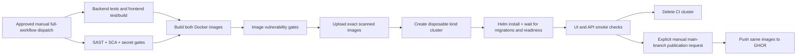

# Session 16 — CI/CD with GitHub Actions

The demo uses the same working TaskBoard application as the final project: [FastAPI backend and React frontend](../final-devops-project/application/), [Dockerfiles](../final-devops-project/docker/), and [full executable workflow](../.github/workflows/final-project.yml). The full security/deployment workflow is **manual only**, awaiting execution approval. A separate [automatic PR workflow](../.github/workflows/assignment-checks.yml) runs unit tests, the frontend build and static Kubernetes/Helm checks; it does not run scans, build images, publish or deploy.

## Pipeline

Continuous integration validates each proposed change through tests and builds. Continuous delivery makes verified artifacts available for release. Continuous deployment automatically installs a verified version into a target environment. Here CD is configured to use a disposable kind cluster inside the GitHub runner; its execution remains pending. Registry publication is an optional, explicit manual action after all validation succeeds; deployment to a persistent or cloud cluster is not automated.

## GitHub Actions concepts

| Concept | This project |
|---|---|
| Workflow | Root `.github/workflows/final-project.yml`; manual dispatch only; `assignment-checks.yml` handles automatic tests/static checks |
| Jobs | Test, source security, image matrix, disposable CD, optional publication |
| Steps | Checkout, setup runtime, install dependencies, execute commands, upload artifacts |
| Runner | Fresh GitHub-hosted `ubuntu-24.04` machine for each job |
| Dependencies | `needs` prevents image builds if tests/scans fail, and prevents deployment if image scans fail |
| Secrets | Random CI-only DB password; optional publication uses GitHub's short-lived `GITHUB_TOKEN` |
| Artifacts | JUnit test results, frontend distribution, redacted scan JSON, scanned image archives, deployment evidence |
| Traceability | Each image and artifact includes `github.sha`; no `latest` promotion |

When executed, the Helm deployment uses an explicitly created `taskboard-ci` cluster and namespace. It waits for migrations, workloads and readiness, then makes real HTTP calls through the frontend proxy. The smoke check creates, reads, updates and deletes a database-backed task, checks statistics, and verifies invalid-input rejection. Cleanup removes only the CI job's cluster.

## Run and inspect

1. Open the pull request or push the homework branch. Read the [automatic tests/static checks](https://github.com/jaivardhandrao/DevOps-Term-9/actions/workflows/assignment-checks.yml). The [full pipeline](https://github.com/jaivardhandrao/DevOps-Term-9/actions/workflows/final-project.yml) remains pending approval and a manual dispatch.
2. Open each job to inspect its commands and exit codes. Download the named artifacts for test/scan/deployment output.
3. A red test or security gate must block downstream images/deployment. `security/test-gates.sh` verifies intentional unsafe fixtures are rejected without committing them.
4. Capture a screenshot of the actual successful run only after all required jobs pass. Automatic PR checks do not demonstrate security or CD; those require the separately approved full run.

## Evidence and remaining demonstration

[Security evidence](../final-devops-project/security/evidence/README.md) records local validation. GitHub pipeline execution and screenshots must be read from the actual run linked by the PR. No successful workflow, registry publication or cloud deployment is claimed solely because these files exist.

The publishing input requires `PUBLISH TO GHCR` and only runs on `main`; do not use it as part of PR validation. A registry demonstration and an external deployment remain separate authorized actions. AWS provisioning is not part of this workflow.
