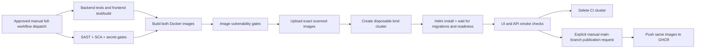
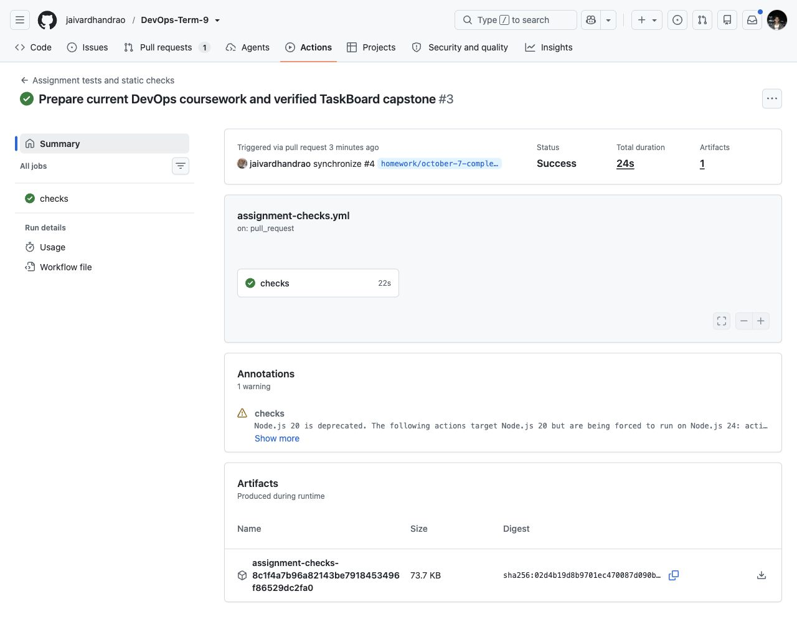
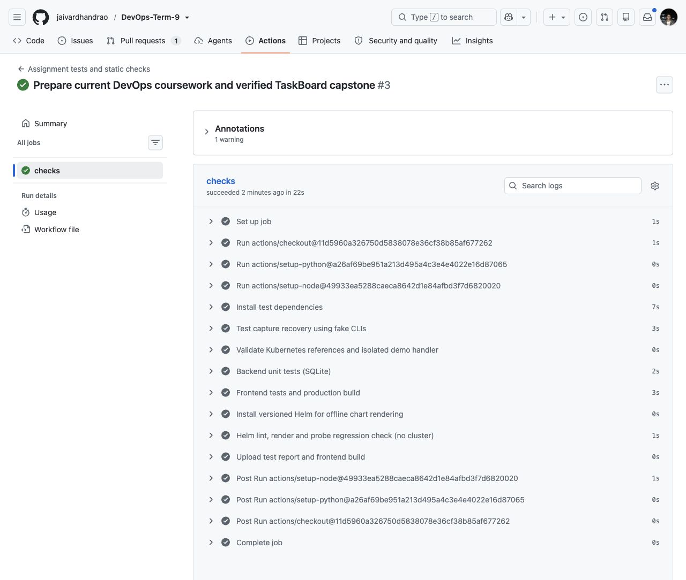
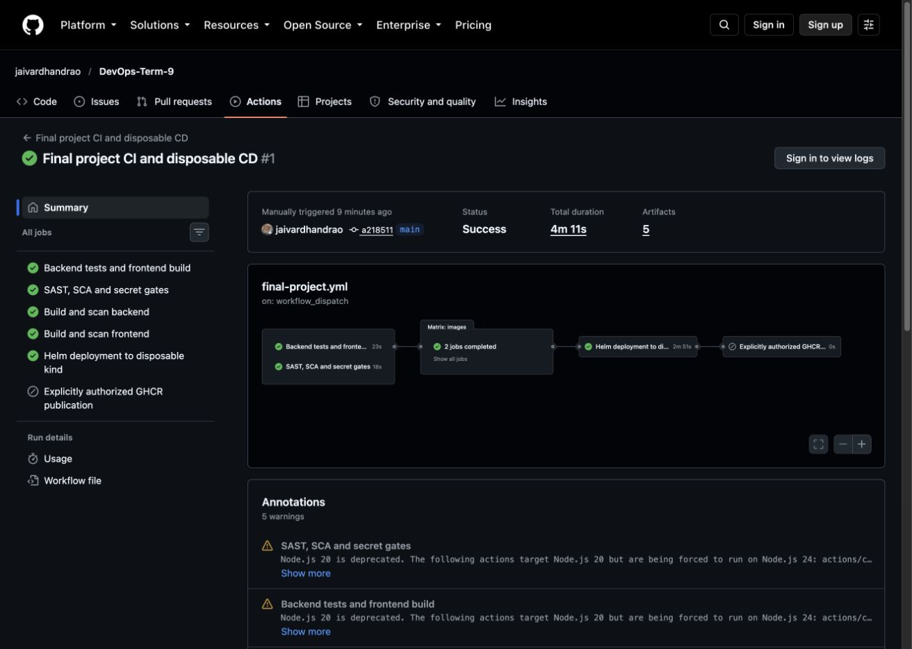
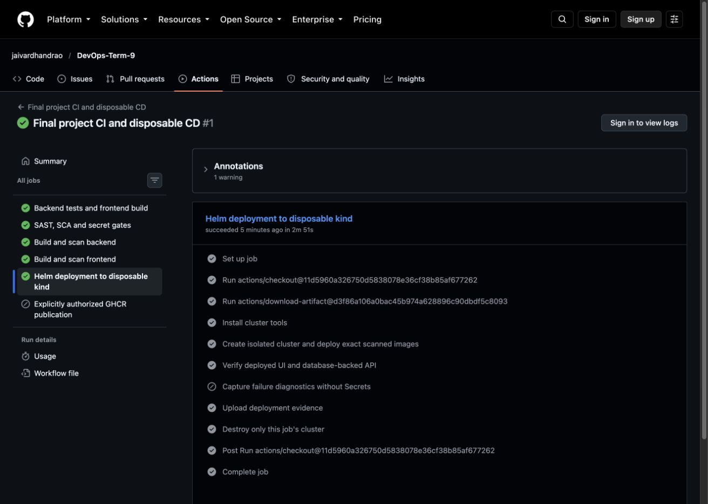

# Session 16 — CI/CD with GitHub Actions

The demo uses the same working TaskBoard application as the final project: [FastAPI backend and React frontend](../final-devops-project/application/), [Dockerfiles](../final-devops-project/docker/), and [full executable workflow](../.github/workflows/final-project.yml). The full security/deployment workflow is **manual only**; registry publication has an additional explicit confirmation. A separate [automatic PR workflow](../.github/workflows/assignment-checks.yml) runs unit tests, the frontend build and static Kubernetes/Helm checks; it does not run scans, build images, publish or deploy.

## Pipeline

Continuous integration validates each proposed change through tests and builds. Continuous delivery makes verified artifacts available for release. Continuous deployment automatically installs a verified version into a target environment. Here CD is configured to use a disposable kind cluster inside the GitHub runner; its actual successful execution is recorded below. Registry publication is an optional, explicit manual action after all validation succeeds; deployment to a persistent or cloud cluster is not automated.

## GitHub Actions concepts

| Concept | This project |
|---|---|
| Workflow | Root `.github/workflows/final-project.yml`; manual dispatch only; `assignment-checks.yml` handles automatic tests/static checks |
| Jobs | Test, source security, image matrix, disposable CD, optional publication |
| Steps | Checkout, setup runtime, install dependencies, execute commands, upload artifacts |
| Runner | Fresh GitHub-hosted `ubuntu-24.04` machine for each job |
| Dependencies | `needs` prevents image builds if tests/scans fail, and prevents deployment if image scans fail |
| Secrets | Random CI-only DB password; optional publication uses GitHub's short-lived `GITHUB_TOKEN` |
| Artifacts | JUnit test results, frontend distribution, redacted scan JSON, scanned image archives, deployment evidence |
| Traceability | Each image and artifact includes `github.sha`; no `latest` promotion |

When executed, the Helm deployment uses an explicitly created `taskboard-ci` cluster and namespace. It waits for migrations, workloads and readiness, then makes real HTTP calls through the frontend proxy. The smoke check creates, reads, updates and deletes a database-backed task, checks statistics, and verifies invalid-input rejection. Cleanup removes only the CI job's cluster.

## Run and inspect

1. Open or update the pull request. Read the [automatic tests/static checks](https://github.com/jaivardhandrao/DevOps-Term-9/actions/workflows/assignment-checks.yml). The [full pipeline](https://github.com/jaivardhandrao/DevOps-Term-9/actions/workflows/final-project.yml) runs by manual dispatch; the verified full run is linked below.
2. Open each job to inspect its commands and exit codes. Download the named artifacts for test/scan/deployment output.
3. A red test or security gate must block downstream images/deployment. `security/test-gates.sh` verifies intentional unsafe fixtures are rejected without committing them.
4. Capture a screenshot of the actual successful run only after all required jobs pass. Automatic PR checks do not demonstrate security or CD; those are verified by the separate full run.

## Evidence and remaining demonstration

[Security evidence](../final-devops-project/security/evidence/README.md) records local validation. GitHub pipeline execution and screenshots must be read from the actual run linked by the PR. No successful workflow, registry publication or cloud deployment is claimed solely because these files exist.

The publishing input requires `PUBLISH TO GHCR` and only runs on `main`; do not use it as part of PR validation. A registry demonstration and an external deployment remain separate authorized actions. AWS provisioning is not part of this workflow.

## Successful automatic CI run

The real [GitHub run 37609532257](https://github.com/jaivardhandrao/DevOps-Term-9/actions/runs/37609532257) completed successfully. This screenshot proves the automatic **tests and static checks** workflow; it does not show security scanning, image publication or a live deployment.

The job view lists the executed unit tests, frontend production build, Kubernetes reference checks, and offline Helm checks.

## Full security and disposable deployment run

The [full run 37664321492](https://github.com/jaivardhandrao/DevOps-Term-9/actions/runs/37664321492) succeeded on `a218511`: tests/build, source security, both AMD64 image builds/scans, and disposable kind/Helm CD all passed. The GHCR publication job was **skipped**. [Preserved real scan reports, API smoke output, Helm/resources/HPA output and job record](../final-devops-project/security/evidence/github-run-37664321492/README.md) show the exact scope. The test cluster was deleted after verification.

The browser capture below shows the actual full run's **Success** result, five completed jobs and skipped publication. Its expanded command output is preserved in the linked artifacts, not shown in this logged-out view.

The deployment job shows successful cluster creation, deployment of the scanned images, UI/API verification, evidence upload and cluster cleanup. Failure diagnostics were skipped because the job passed.

