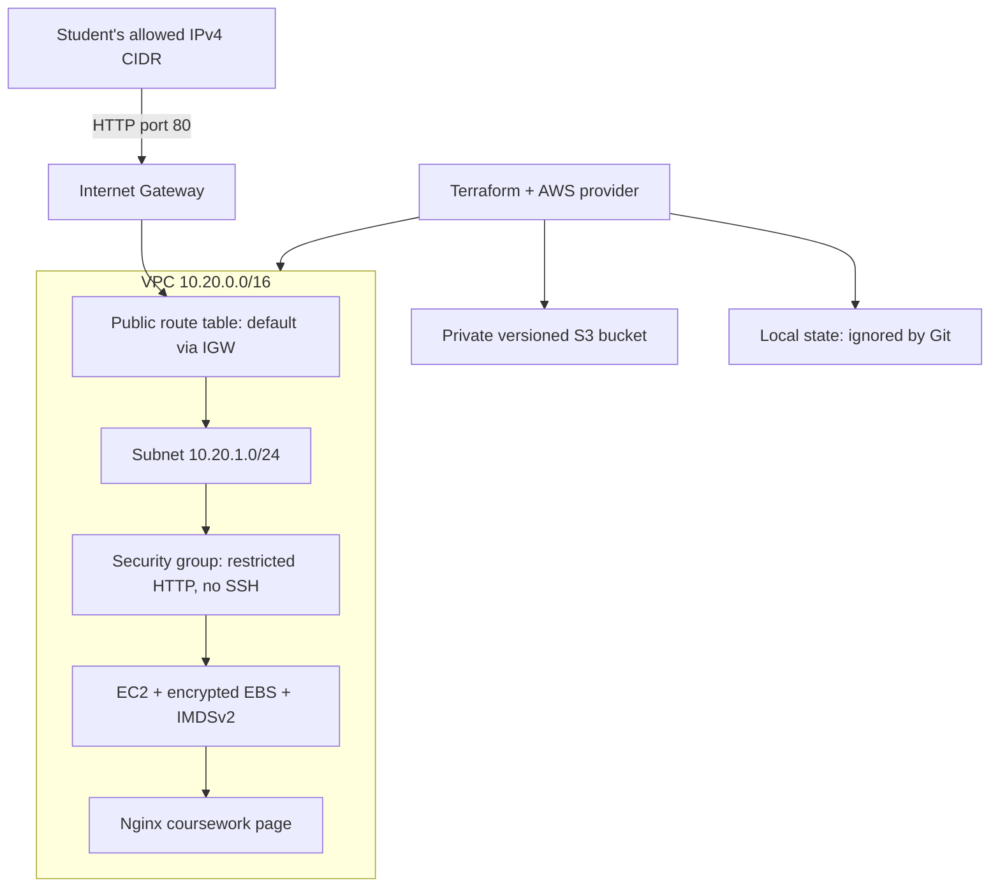

# Session 19 — Cloud infrastructure with Terraform

Jaivardhan D. Rao · 24BCS10117

This project combines a VPC, subnet, internet routing, security group, EC2 web server and private
S3 storage. It extends the instructor's network-only mini project with the EC2 and S3 resources
listed in the current homework. The Nginx page identifies this coursework; it does not need
database credentials, an SSH key or permission to read the S3 bucket.

**Status:** Provider initialization, schema validation and all four mocked tests passed on 7 October 2026.
AWS resources, live plan/apply,
HTTP verification, destroy and screenshots remain pending. [Actual local validation output](evidence/local-validation.txt)
is kept separately from the runbook. Mock plans prove configuration properties, not real AWS
deployment, AMI availability, account permissions or successful cloud-init.

## Architecture



The EC2 instance has an explicit public IP. The subnet does not auto-assign IPs to every future
instance. The route-table association supplies the internet path; the security group restricts
the inbound source to `allowed_http_cidr`. Outbound HTTP/HTTPS permits package installation.
The instance has no SSH ingress or IAM role. S3 has public access blocked, ACLs disabled,
versioning and encryption enabled, and refuses implicit deletion of nonempty contents.

This is a single-AZ classroom HTTP demo. It does not claim TLS, high availability, a production
load balancer, or a Kubernetes cluster. The S3 bucket is a separate private artifact store;
the EC2 page is served from its local filesystem.

## How the configuration fits together

| Concept | Implementation |
| --- | --- |
| Provider | `provider.tf` pins AWS 6.58.0, sets Region and common tags |
| Variables | `variables.tf` validates the project name, /16 network, restricted source CIDR and supported instance types |
| Data sources | Available AZs and Amazon's regional SSM parameter for an Amazon Linux 2023 x86_64 AMI |
| Resources | VPC, subnet, IGW, route table/association, security group/rules, EC2 and S3 controls |
| Implicit dependencies | Subnet → VPC, security group → VPC, EC2 → subnet/security group/AMI |
| Explicit dependencies | EC2 waits for routing and egress rules before package installation starts |
| Outputs | VPC/subnet/security group/instance IDs, website URL and bucket name |
| State | Local resource-ID mapping in ignored `terraform.tfstate`; keep it secure until cleanup completes |

The AMI lookup avoids copying a region-specific image ID from a different account or tutorial.
Its value is public image metadata; `nonsensitive()` is used only to remove the provider's generic
SSM sensitivity mark from that public AMI ID. No private SSM parameters are read.

## Credential-free validation

```bash
terraform init -backend=false
terraform fmt -check -recursive
terraform validate
terraform test
```

All tests in `tests/infrastructure.tftest.hcl` use a mock AWS provider with fictitious AMI/AZ
fixtures. The positive plan checks the derived subnet, internet route, HTTP source restriction,
IMDSv2, encrypted EBS, public-IP choice, private S3 and bootstrap page. Negative plans reject
internet-wide inbound access, unsupported VPC sizes and incompatible ARM instance types.
These commands do not deploy resources. Provider initialization does need internet access to
download the public provider package.

## Real AWS execution — still to do

Use a disposable coursework account with an existing short-lived AWS SSO/role session. EC2,
EBS, public IPv4 and S3 may incur charges; review the plan and remove the stack after collecting
evidence. Do not put access keys in Terraform files or Git.

```bash
cp terraform.tfvars.example terraform.tfvars
# Edit allowed_http_cidr to your public IPv4/32 or trusted classroom CIDR.
# 203.0.113.10/32 is a documentation address, not the student's actual network.
aws sts get-caller-identity
terraform init
terraform fmt -check -recursive
terraform validate
terraform plan -out=coursework.tfplan
terraform apply coursework.tfplan
terraform show
terraform state list
terraform output
```

Wait for EC2 status checks and cloud-init to finish, then open the emitted `website_url` from
the allowed client network. The page must contain `Hello from jvrao-term9` for the default
project name. The EC2 instance reaching `running` does not alone prove Nginx is ready.

```bash
terraform output -raw website_url
# Copy the emitted URL into a browser or a curl request from the allowed network.
```

Capture the VPC/subnet/routes, security-group inbound rules, EC2 state and web page, S3 controls,
plus the actual plan/apply/output transcript. Mask account identifiers in published screenshots
where appropriate; never include credentials or unreviewed full state.

## Troubleshooting and cleanup

| Symptom | Check before changing anything |
| --- | --- |
| AMI/AZ lookup denied | Confirm account/Region and permissions for the public SSM parameter and EC2 AZ lookup |
| Invalid or unavailable instance | Check regional capacity and the selected x86_64 instance type |
| Website times out | Correct client public IP/CIDR, EC2 public IP, subnet route/association and SG rule |
| EC2 is running but HTTP not ready | Wait for initialization; inspect console system log for package/cloud-init failures |
| Terraform says bucket not empty | Review and remove the lab object's versions/delete markers; do not bypass the protection blindly |

Clean up only this stack, using its original state and the same account/Region:

```bash
terraform plan -destroy
terraform destroy
terraform state list
```

Review the proposed deletion before confirming. The bucket is intentionally empty, so destroy
should not need content deletion. Verify the instance is terminated, managed storage/network
resources and the bucket are gone, and `terraform state list` is empty. Preserve the evidence,
not credentials or state, in the submission. Do not delete state while resources still exist.

## Evidence checklist

- Local format, schema and mocked-plan checks: see the linked raw log.
- Real AWS plan/apply, created resources and HTTP response: **pending**.
- Architecture diagram and source files: present here.
- AWS console/browser screenshots and destroy verification: **pending**.

References: [Terraform tests](https://developer.hashicorp.com/terraform/language/tests),
[AWS instance resource](https://registry.terraform.io/providers/hashicorp/aws/6.58.0/docs/resources/instance),
[Amazon Linux AMI parameters](https://docs.aws.amazon.com/AWSEC2/latest/UserGuide/finding-an-ami-parameter-store.html),
[VPC internet access](https://docs.aws.amazon.com/vpc/latest/userguide/VPC_Internet_Gateway.html).
