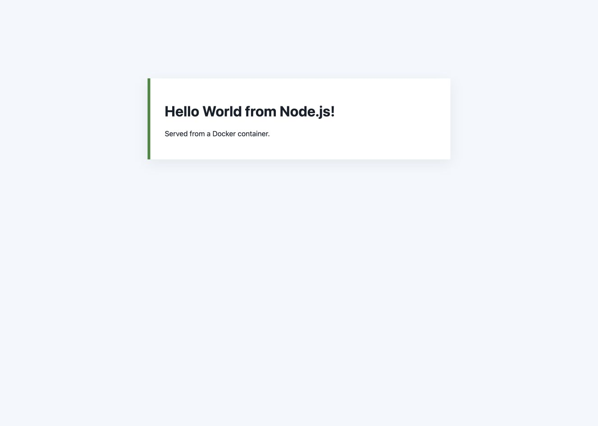
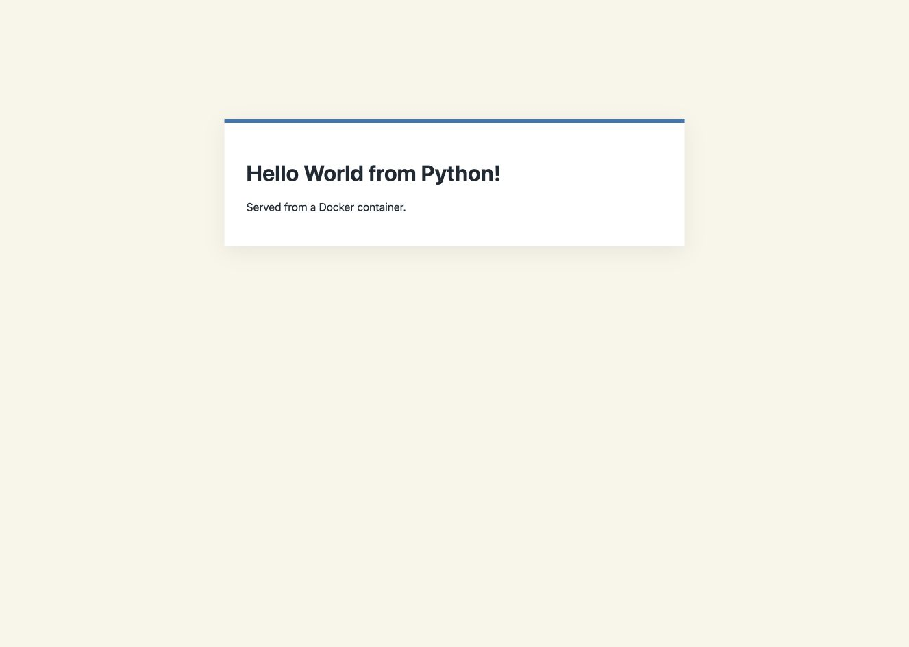
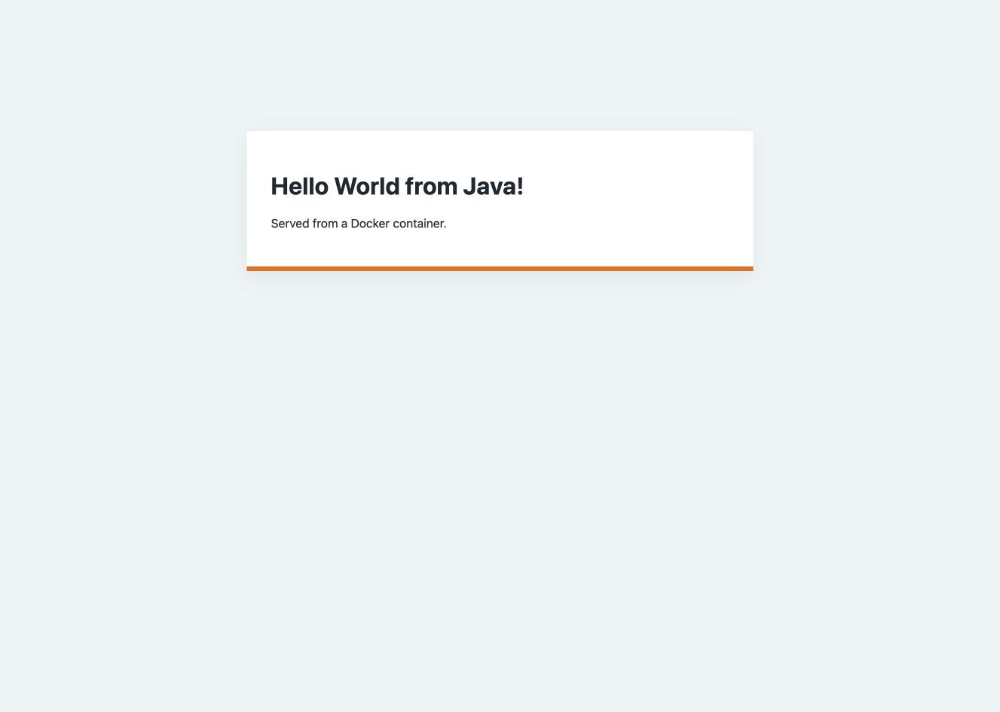
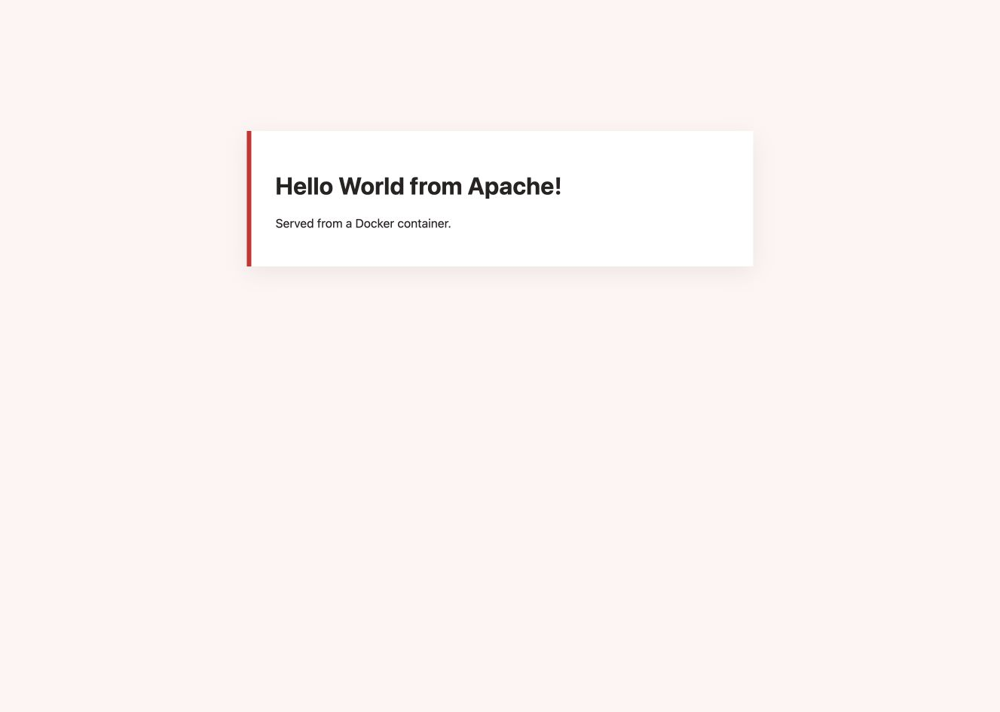
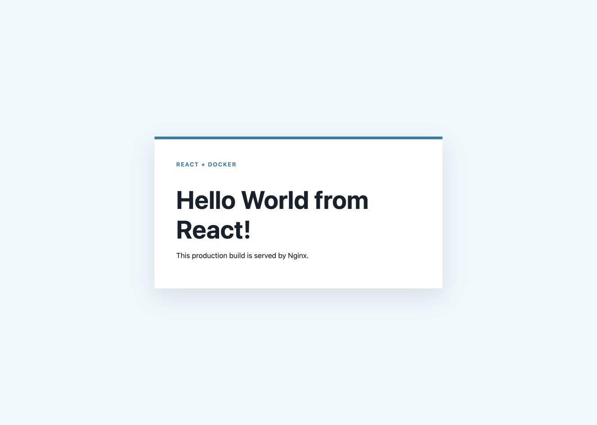
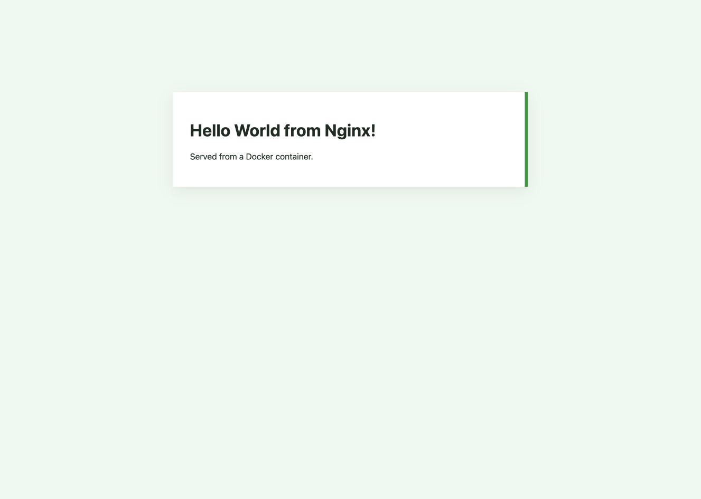

# Docker Hello World applications

The six applications are deliberately small so that each Dockerfile is easy to inspect. They use
different runtimes but return a webpage with the same basic idea.

| Folder | Runtime | Host port |
| --- | --- | ---: |
| `nodejs-app` | Node.js HTTP server | 8101 |
| `python-app` | Python HTTP server | 8102 |
| `java-app` | Java HTTP server | 8103 |
| `Apache-app` | Apache httpd | 8104 |
| `React-app` | React production build on Nginx | 8105 |
| `nginx-app` | Nginx static page | 8106 |

## Build and run one application

Run these commands from the repository root, changing the folder, image name, and port as needed:

```bash
docker build -t devops-node ./docker-apps/nodejs-app
docker run --rm -d --name devops-node -p 8101:3000 devops-node
curl http://localhost:8101
docker stop devops-node
```

The full set of commands I ran and their HTTP responses are in [verification.txt](verification.txt).
All containers used `--rm`, so stopping them also removed them.

## Fresh builds and browser screenshots — 7 October 2026

[Raw build, HTTP, and `docker ps` output](evidence/live-20261007T180044Z.txt) records fresh builds and successful responses for all six Dockerfiles. The runner assigns free loopback ports so it does not occupy another application's port. This capture used Node.js `55011`, Python `55012`, Java `55013`, Apache `55014`, React `55015`, and Nginx `55016`. The React page was also checked in the actual browser after JavaScript rendered.

These are unaltered screenshots of the live application pages, captured through a dedicated Chrome task tab. They are browser screenshots, while command evidence is provided in the linked raw transcript. Containers were removed after capture; the temporary localhost URLs are not hosted submission links.

### Node.js



### Python



### Java



### Apache



### React



### Nginx



Reproduce from the repository root: `python3 scripts/run-foundation-evidence.py --topic docker --pause`. This builds the actual applications, prints the assigned URLs, and waits before removing only its own containers and image tags.
