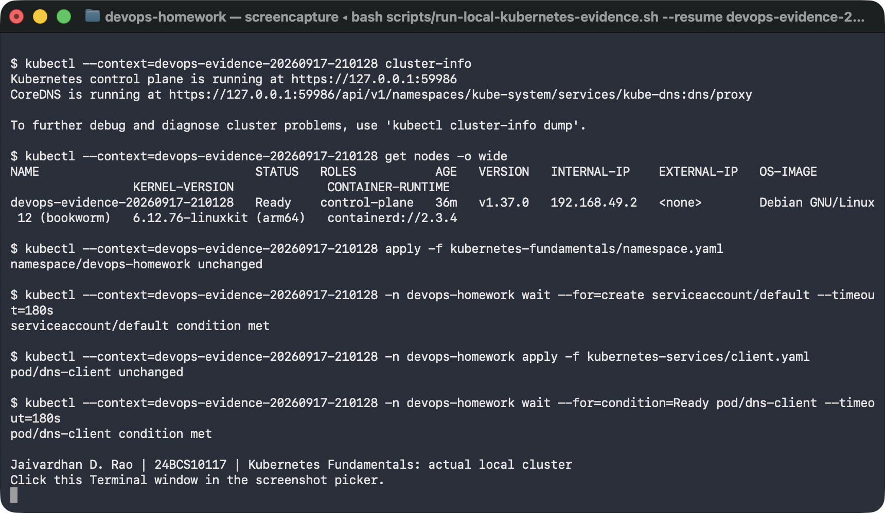

# Actual local Kubernetes evidence

**Jaivardhan D. Rao · 24BCS10117 · 17 September 2026**

## Fundamentals

[Exact fundamentals transcript from the resumed run](01-fundamentals.txt)

The runner saved this actual Terminal window screenshot during attempt
`20260917-213953` on local Minikube profile `devops-evidence-20260917-210128`. The node is
`Ready`, the namespace exists, the default ServiceAccount exists, and the `dns-client` Pod
reached `Ready`. The transcript also records the successful CoreDNS rollout wait.
The [read-only system Pod inventory](01-system-pods-follow-up.txt) records all eight system
Pods Running and ready.

## Session 10: recorded run and read-only follow-up

- [Exact student-run transcript](02-session-10-partial.txt): standalone Pod creation, ReplicaSet
  scaling and replacement, Deployment rollout, `Hello from v1`, update to `Hello from v2`, and
  successful rollback rollout. The immediate HTTP request after rollback failed with
  `Connection refused`, stopping the script before the session 10 screenshot.
- [Actual read-only follow-up](02-session-10-follow-up.txt): ready workloads, three Service
  endpoints, rollout history, and `Hello from v1` fetched from the existing client Pod.
  This check did not replay the rollout or create coursework resources.

The later HTTP success is consistent with a transient post-rollout failure; the initial log
does not establish its precise networking cause. The runner now retries failed HTTP/DNS
reads up to 15 times and stops if they remain unsuccessful. HTTP requests use a five-second
timeout. Retries are confined to reads and do not repeat the rollout commands.

The session 10 screenshot and additional strategy/lifecycle exercises remain pending.
Sessions 11 and 12 did not run in this attempt, and their live screenshots remain pending.

## Earlier screenshot-picker conflict

The student's [previous screenshot](01-fundamentals-picker-conflict.png) and
[original transcript](01-fundamentals-picker-conflict.txt) are preserved. That attempt reached
the fundamentals checkpoint but stopped when macOS reported an overlapping screen capture.

The runner now pauses after a failed or cancelled screenshot attempt. Close the other picker
with Escape and press Enter to retry, or paste the full path of a manually saved PNG without
surrounding quotes. It copies that file into the attempt folder before continuing. Invalid
paths and non-PNG files leave the checkpoint paused; Ctrl-C stops the run.
