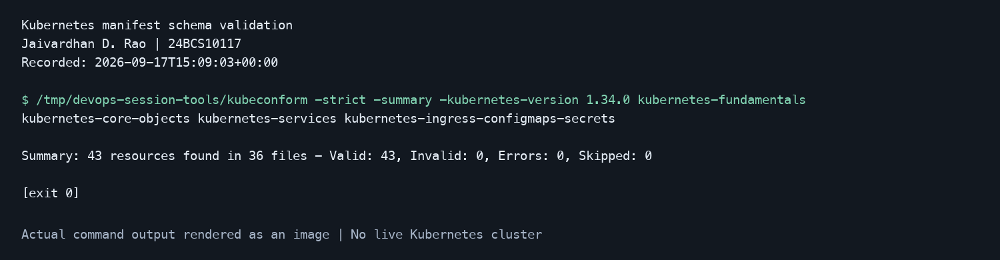
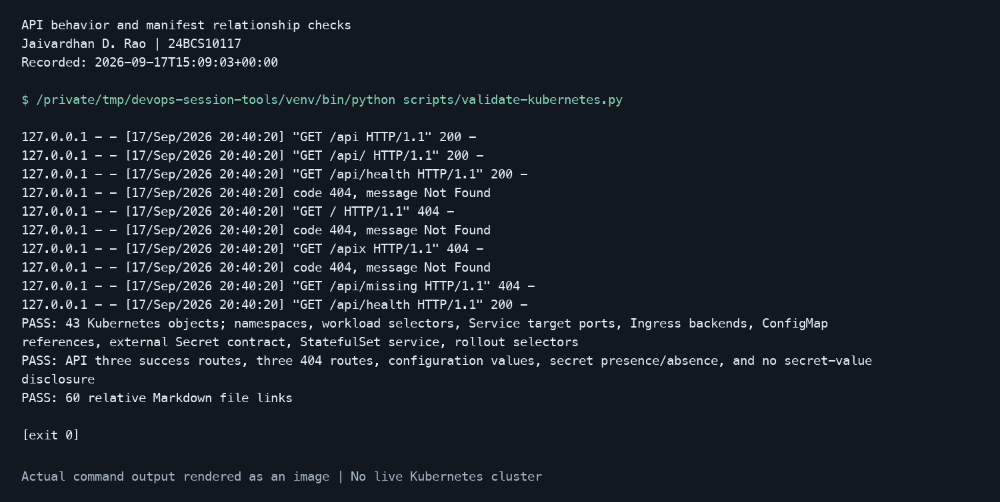
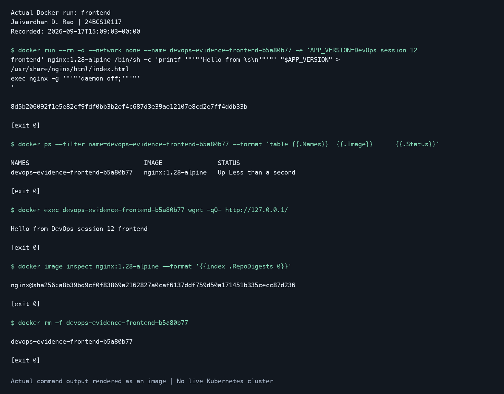
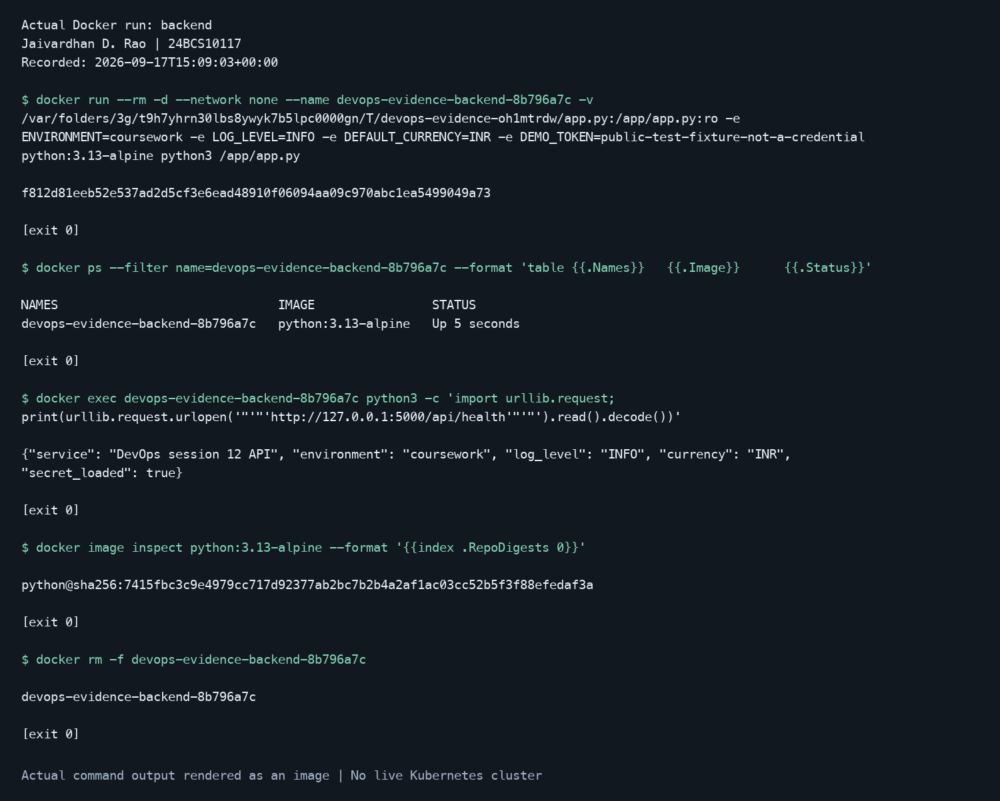

# Recorded local execution evidence

**Jaivardhan D. Rao · 24BCS10117**

These PNGs render verbatim command output from fresh local executions. They are **recorded
output images, not screenshots of a desktop Terminal window or a live Kubernetes cluster**.
The corresponding text files contain the command lines, observed output, and exit codes.
No expected Kubernetes output has been fabricated.

## Schema validation



[Raw transcript](01-schema-validation.txt)

## API and resource-reference checks



[Raw transcript](02-api-and-references.txt)

## Nginx container



[Raw transcript](03-frontend.txt)

## Python API container



[Raw transcript](04-backend.txt)

The two containers were started for these checks with networking disabled, queried through
loopback from inside each container, and removed after the capture. The printed demo token
in the run command is explicitly public fixture text, not a real credential.

## Reproduce the images

On macOS, use Python with PyYAML and Pillow installed, Docker running, and kubeconform available:

```bash
python3 scripts/capture-local-evidence.py --kubeconform kubeconform
```

This uses the manifests' real commands and API source. Image generation requires the system
Menlo font. Output is saved alongside this README.

## Capture actual Kubernetes Terminal screenshots

The [student-run script](../../scripts/run-local-kubernetes-evidence.sh) creates a new local
Minikube profile, runs the principal exercises, saves the complete command transcript, and
opens the macOS screenshot picker at four checkpoints. Click the Terminal window at each
checkpoint to capture it. The student ran the original script and hit a
[startup race](../startup-race/README.md). The corrected version has regression checks;
its full live rerun remains pending.

Prerequisites: Docker Desktop running, kubectl, Minikube, Python 3, and macOS screen capture.
For Minikube, the Homebrew install command is `brew install minikube`.

From the repository root:

```bash
bash scripts/run-local-kubernetes-evidence.sh
```

For an interrupted run, reuse the existing local profile:

```bash
bash scripts/run-local-kubernetes-evidence.sh --resume devops-evidence-20260917-210128
```

The script writes screenshots and logs under `evidence/live/<profile>/attempt-<timestamp>/`.
It waits for node, CoreDNS, and default ServiceAccount readiness before creating coursework
Pods, and keeps earlier attempt logs and screenshots intact.
It exercises fundamentals, core-object scaling/update/rollback, Service DNS/NodePort/headless
discovery, and Ingress/configuration reload. Additional lifecycle, strategy, and TLS exercises
remain documented in the session READMEs. It retains its uniquely named local cluster and
prints the exact cleanup command. It never selects a shared or cloud Kubernetes context.

The script uses the instructor's classroom Ingress NGINX addon; the retirement note in the
[session 12 README](../../kubernetes-ingress-configmaps-secrets/README.md) applies.
