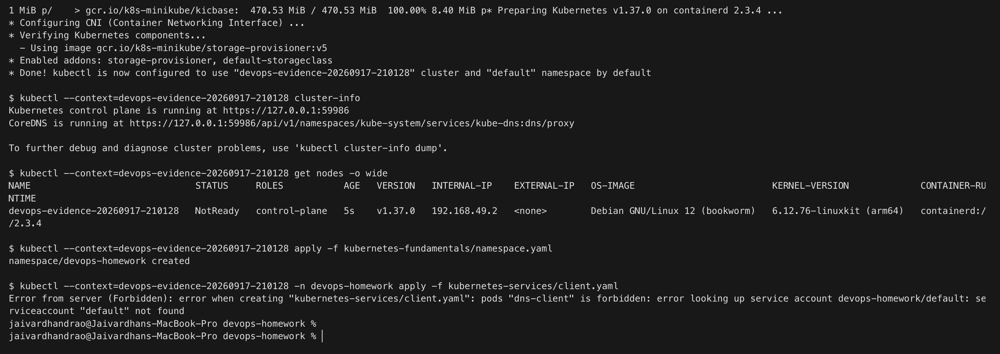

# First live attempt: startup race and correction

**Jaivardhan D. Rao · 24BCS10117 · 17 September 2026**

This is the student's original Terminal screenshot of a failed local run. It is retained as
troubleshooting evidence, not as a successful lab screenshot.



[Exact command-output excerpt from the original run](initial-failure-excerpt.txt)

The Minikube API was responding, but the node was only five seconds old and still `NotReady`.
Immediately after creating `devops-homework`, the script attempted to create `dns-client`.
The namespace's automatically managed `default` ServiceAccount did not exist yet, so Pod
admission rejected the request. This was not evidence of missing student permissions.

A subsequent read-only inspection of `devops-evidence-20260917-210128` found the node `Ready`
and the default ServiceAccount present, with no homework Pods yet. The actual read-only wait
commands also completed successfully:

```text
node/devops-evidence-20260917-210128 condition met
serviceaccount/default condition met
```

## Correction

The [runner](../../scripts/run-local-kubernetes-evidence.sh) now waits for the node to become
Ready, CoreDNS to finish rolling out, and `serviceaccount/default` to exist before creating
the client Pod. If either prerequisite times out, it stops before the dependent operation.

It can resume an existing, running local profile without starting another cluster. Every
attempt receives a new subdirectory so the original failed log and prior screenshots remain
intact. It also reuses an existing demo Secret and reloads the backend configuration on resume.

From the repository root, continue this exact local cluster with:

```bash
bash scripts/run-local-kubernetes-evidence.sh --resume devops-evidence-20260917-210128
```

The script opens the screenshot picker at each checkpoint; click the Terminal window to
capture it. A full successful rerun remains pending. Regression checks use fake command-line
tools in temporary directories, without changing a Kubernetes cluster or creating submission
screenshots:

```bash
python3 scripts/test_evidence_startup.py
```

References: [default ServiceAccounts](https://kubernetes.io/docs/concepts/security/service-accounts/#default-service-accounts),
[kubectl wait](https://kubernetes.io/docs/reference/kubectl/generated/kubectl_wait/).
