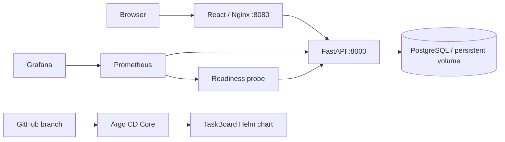

# Final DevOps project — TaskBoard

**Jaivardhan D. Rao · 24BCS10117 · Session 21**

TaskBoard is an original React/FastAPI application backed by PostgreSQL. It provides task creation, editing, deletion, status and priority changes, search, aggregate counts and a responsive layout. The implementation connects application tests, container builds, Kubernetes manifests, Helm, CI/security gates, Terraform, monitoring and GitOps.

**Status: local application verified; the full platform demonstration is incomplete.** Eleven backend tests and five frontend tests pass. Both images build, and real PostgreSQL CRUD, outage recovery and persistence after restart were exercised. Kubernetes application deployment, full security/CI execution, registry publication, cloud provisioning and GitOps reconciliation have not been verified. See [the repository evidence checklist](../EVIDENCE-CHECKLIST.md).

## Architecture



The diagram describes the supplied platform design. The locally verified application uses Compose; the Argo and Kubernetes application paths remain pending.

## Run locally

From this directory:

```sh
python3 application/setup-local.py
docker compose up --build -d
python3 application/smoke.py
```

Open **http://127.0.0.1:18080**. The named Compose project is `devops-oct7-capstone`; only its frontend publishes a loopback port. Database credentials are generated into ignored `.runtime/` files. The application is an unauthenticated classroom demo intended for local/private use.

## Components and requirements

| Requirement | Implementation and operating instructions |
| --- | --- |
| Frontend, backend, PostgreSQL, REST API and tests | [Application](application/README.md), including CRUD routes, input validation, health/readiness and metrics |
| Docker images and local orchestration | [Dockerfiles](docker/), [Compose](compose.yaml), [verified application evidence](application/evidence/README.md) |
| CI/CD and security gates | [CI/CD](../ci-cd/README.md), [DevSecOps](../devsecops/README.md), [security controls](security/README.md), [executable root workflow](../.github/workflows/final-project.yml) |
| Kubernetes resources | [Rendered initial-install example](kubernetes/README.md) |
| Helm, ingress, HPA and probes | [Chart and release runbook](helm/README.md) |
| Cloud infrastructure | [EKS Terraform](terraform/README.md), with mocked tests and an explicit deployment guard |
| Metrics, logs, dashboards and alerts | [Monitoring](monitoring/README.md) and [actual monitoring evidence](monitoring/evidence/2026-10-07/README.md) |
| GitOps | [Argo CD Core setup and drift-reconciliation exercise](gitops/README.md) |
| Fault diagnosis and fixes | [Troubleshooting runbook](troubleshooting/README.md) |

Migrations run as an explicit one-shot Compose service or Kubernetes Job. Readiness checks database/schema availability; backend liveness checks the process. Frontend probes request its static `/` route so a backend outage does not restart a healthy frontend. PostgreSQL uses persistent storage; the application outage/restart test verifies actual retained data in Compose. Kubernetes PVC recovery remains a separate pending demonstration.

The full CI workflow is manually dispatched while runtime approval is unresolved. Its gates are retained; no successful scan, publish or deployment is inferred from the workflow file. GitHub executes workflows from the repository root, not this project's nested `.github/` documentation folder.

## Actual evidence and remaining work

- [Application evidence](application/evidence/README.md): 16 tests, successful builds, real PostgreSQL HTTP checks, database outage/recovery, restart persistence, desktop and 390px mobile screenshots.
- [Terraform evidence](terraform/evidence/local-validation.txt): real provider-schema validation plus four mocked EKS tests. No AWS resources were created.
- Helm lint and default/CI/Ingress rendering passed. The frontend probe regression is checked by [the chart contract script](../scripts/check-chart-probes.py).
- Monitoring has three ready Pods and a healthy seven-panel Grafana dashboard. Because the Kubernetes application is absent, its target is down and availability alerts fire; this does not prove application monitoring recovery.
- Complete sessions 13–15 live exercises, security scans/full CI, Kubernetes application deployment and persistence, registry publication, alert recovery, GitOps reconciliation and explicitly authorized AWS deployment/cleanup before claiming full coursework completion. Capture actual screenshots where required.


