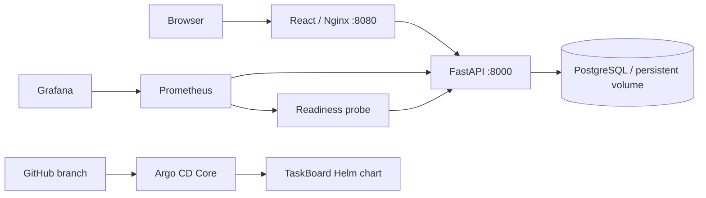
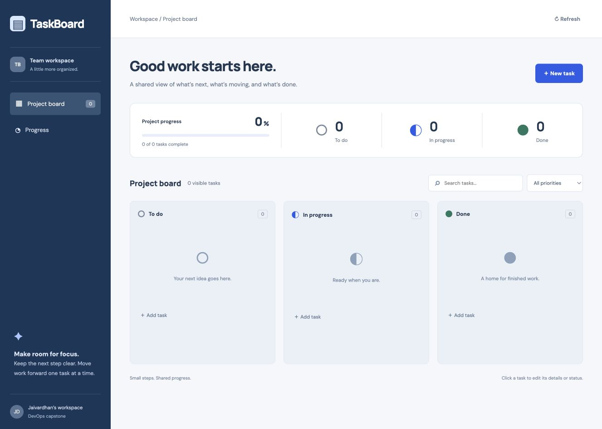

# Final DevOps project — TaskBoard

**Jaivardhan D. Rao · 24BCS10117 · Session 21**

TaskBoard is an original React/FastAPI application backed by PostgreSQL. It provides task creation, editing, deletion, status and priority changes, search, aggregate counts and a responsive layout. The implementation connects application tests, container builds, Kubernetes manifests, Helm, CI/security gates, Terraform, monitoring and GitOps.

**Status: the local application, isolated Kubernetes platform and full CI/CD run are verified.** Eleven backend tests and five frontend tests pass. The patched images have clean HIGH/CRITICAL vulnerability reports and run in the isolated cluster. Real CRUD, PostgreSQL PVC persistence, healthy metrics/dashboard, readiness-alert recovery and Argo reconciliation/self-healing were exercised. Registry publication, live AWS provisioning and some requested command-state screenshots remain incomplete. See [the requirement-by-requirement checklist](../EVIDENCE-CHECKLIST.md).

## Architecture



The diagram reflects both the verified Compose application and the later Kubernetes/Argo demonstration. Kubernetes runtime uses only `devops-oct7` / `capstone-oct7`; observability and Argo Core run in `monitoring-oct7`.

## Run locally

From this directory:

```sh
python3 application/setup-local.py
docker compose up --build -d
python3 application/smoke.py
```

Open **http://127.0.0.1:18080**. The named Compose project is `devops-oct7-capstone`; only its frontend publishes a loopback port. Database credentials are generated into ignored `.runtime/` files. The application is an unauthenticated classroom demo intended for local/private use.

## Components and requirements

| Requirement | Implementation and operating instructions |
| --- | --- |
| Frontend, backend, PostgreSQL, REST API and tests | [Application](application/README.md), including CRUD routes, input validation, health/readiness and metrics |
| Docker images and local orchestration | [Dockerfiles](docker/), [Compose](compose.yaml), [verified application evidence](application/evidence/README.md) |
| CI/CD and security gates | [CI/CD](../ci-cd/README.md), [DevSecOps](../devsecops/README.md), [security controls](security/README.md), [executable root workflow](../.github/workflows/final-project.yml) |
| Kubernetes resources | [Rendered initial-install example](kubernetes/README.md) |
| Helm, ingress, HPA and probes | [Chart and release runbook](helm/README.md) |
| Cloud infrastructure | [EKS Terraform](terraform/README.md), with mocked tests and an explicit deployment guard |
| Metrics, logs, dashboards and alerts | [Monitoring](monitoring/README.md) and [actual monitoring evidence](monitoring/evidence/2026-10-07-completed/README.md) |
| GitOps | [Argo CD Core setup and drift-reconciliation exercise](gitops/README.md) |
| Fault diagnosis and fixes | [Troubleshooting runbook](troubleshooting/README.md) |

Migrations run as an explicit one-shot Compose service or Kubernetes Job. Readiness checks database/schema availability; backend liveness checks the process. Frontend probes request its static `/` route so a backend outage does not restart a healthy frontend. PostgreSQL uses persistent storage. Both Compose and Kubernetes persistence were exercised: the Kubernetes database Pod UID changed while its PVC UID and saved task stayed intact. The disposable test task was removed afterward.

The full CI workflow is manually dispatched. [Run 37664321492](https://github.com/jaivardhandrao/DevOps-Term-9/actions/runs/37664321492) passed tests, source/image security gates and disposable kind/Helm deployment with real CRUD. Registry publication was skipped and its cluster was deleted. GitHub executes workflows from the repository root, not this project's nested `.github/` documentation folder.

## Actual evidence and remaining work

- [Application evidence](application/evidence/README.md): 16 tests, real PostgreSQL HTTP checks, outage/recovery, restart persistence, desktop and mobile screenshots.
- [Kubernetes evidence](kubernetes/README.md): Helm install/migrations, passing CRUD and validation, Pod replacement with preserved PVC/task data, valid HPA CPU metrics and the actual deployed interface below.
- [Patched runtime image identities](kubernetes/evidence/2026-10-07/patched-runtime-images.json) map the running backend/frontend config digests to the scanned OCI builds. [Security reports](security/evidence/README.md) preserve the genuine before/after findings; no CVE exceptions were added.
- [Full CI/CD evidence](security/evidence/github-run-37664321492/README.md): the independent GitHub AMD64 builds/scans and disposable deployment passed on `a218511`. Local runtime evidence uses ARM64 images and is distinguished from that CI run.
- [Monitoring](monitoring/evidence/2026-10-07-completed/README.md): healthy app telemetry, container/process CPU and memory, logs, actual Grafana screenshot, a firing readiness alert and recovery. A surviving scrape connection kept metrics `up=1` during the routing fault; no unobserved alert is claimed.
- [GitOps](gitops/README.md): Argo Synced/Healthy at `a21851154ac1bf984ab7c7a0304073a19faac27d`, followed by automatic correction of deliberate ConfigMap drift. [Final reconciliation](gitops/evidence/2026-10-07/final-reconciliation.json) confirms healthy state and restored automatic synchronization after fault testing.
- [Troubleshooting](troubleshooting/evidence/2026-10-07/README.md): actual selector failure/HTTP502/readiness alert and recovery, plus a separate `ErrImageNeverPull` fault corrected to the available image and cleaned up.
- [Terraform evidence](terraform/evidence/local-validation.txt): real provider-schema validation and four mocked EKS tests. No AWS resources were created.

Registry publication and the live cloud lifecycle remain pending; the full run used `publish_images=false`. Distributed tracing is explained but no trace collector/backend is installed. Remaining assignment screenshot gaps are listed in the root checklist. Native Terminal capture was unavailable; actual command transcripts are supplied without presenting them as screenshots.



The empty board is the real post-test state after temporary CRUD/persistence tasks were removed. [Local desktop/mobile captures](application/evidence/README.md) separately demonstrate the populated interface.


The dashboard's RSS thresholds use bytes tied to the backend memory request/limit. The [original screenshot](monitoring/evidence/2026-10-07-completed/grafana-before-threshold-fix.jpg) is retained to document the corrected default-threshold display bug.
