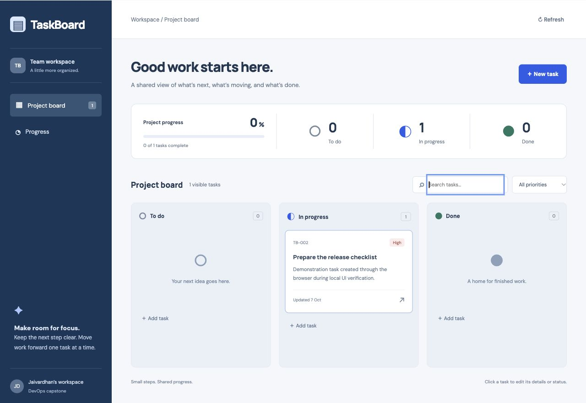

# TaskBoard application

An original team task board with a React/Vite frontend, FastAPI API and PostgreSQL storage. Tasks have a title, description, status and priority. The interface supports creation, editing, status changes, deletion, search and priority filters, with keyboard-accessible forms, loading/error states and a single-column mobile layout.

This is a classroom demonstration without authentication or tenant isolation. Keep it on loopback or a private classroom cluster. Add authentication, authorization, TLS and backups before exposing it as a shared service. UI task content is rendered as text, not HTML.

## Local Docker setup

From `final-devops-project/`:

```sh
python3 application/setup-local.py
docker compose up --build -d
docker compose ps
python3 application/smoke.py
```

Open **http://127.0.0.1:18080**. The only published port is loopback 18080. PostgreSQL and the backend remain on the internal Compose network. The generated password is preserved on repeated setup and stored only in ignored `.runtime/`; do not commit it. A separate one-shot `migrate` service upgrades the schema before backend startup. Application containers run without root and do not modify the schema at startup.

The `postgres_data` volume preserves tasks when application containers restart. `docker compose down` stops this demonstration while retaining data. Do not run volume-deletion commands unless discarding this demo's data is intended. Rotating the local secret alone does not rotate an existing PostgreSQL volume's password.

## Run and test without a host installation

```sh
docker compose --profile test build test
docker compose --profile test run --rm test
docker compose build frontend  # npm test and production Vite build run here
python3 application/smoke.py   # running PostgreSQL integration, creates/deletes one task
python3 application/verify-persistence.py  # briefly stops this demo's DB; tests recovery
```

The API suite uses a fresh in-memory SQLite database per test to check CRUD, validation, filters/pagination, not-found handling, metrics cardinality and readiness failure behavior. It does not substitute for the separate PostgreSQL integration check. `smoke.py` uses the real running stack through Nginx and verifies counts return to their original values after cleanup.

`verify-persistence.py` is an explicit failure drill for this named disposable stack only. It creates a probe task, stops PostgreSQL, verifies liveness stays 200 while readiness becomes 503, restarts PostgreSQL and the backend, verifies the same task persists, then deletes only its own probe. Do not run the drill against a shared or production service.

For optional direct development, create a local Python environment in `backend/`, install `requirements-dev.txt`, set a PostgreSQL `DATABASE_URL`, run `alembic upgrade head`, then `uvicorn app.main:app --reload --port 8000`. In `frontend/`, run `npm ci` and `npm run dev`; Vite proxies API/health routes to loopback port 8000. Do not use a personal or production database for these commands. Backend tests: `python -m pytest -q`; frontend request/error tests: `npm test`.

## Runtime contract

| Component | Contract |
| --- | --- |
| Backend | Port 8000; `uvicorn app.main:app --host 0.0.0.0 --port 8000` |
| Frontend | Port 8080; Nginx proxies `/api/`, `/health`, `/ready`, `/metrics` |
| Proxy configuration | `BACKEND_UPSTREAM=backend:8000` |
| Database URL | `DATABASE_URL_FILE` takes precedence, then `DATABASE_URL` |
| Structured database settings | `DB_HOST`, `DB_PORT`, `DB_NAME`, `DB_USER`, `DB_PASSWORD_FILE` (or `DB_PASSWORD`) |
| Defaults excluding password | Host `postgres`, port `5432`, database/user `taskboard` |
| Migration | `alembic upgrade head`, once per release before serving traffic |
| Backend image | Context `final-devops-project/`, Dockerfile `docker/backend.Dockerfile` |
| Frontend image | Same context, Dockerfile `docker/frontend.Dockerfile` |

There is no default database password. The structured configuration safely handles special characters without constructing a URL by string concatenation. Never print database environment values into evidence logs.

## APIs and observability

| Method | Route | Behavior |
| --- | --- | --- |
| GET | `/api/tasks` | Newest first; optional `status`, `limit` (1–500), `offset` |
| POST | `/api/tasks` | Create a task, return 201 and Location header |
| GET | `/api/tasks/{id}` | Fetch task or return 404 |
| PUT | `/api/tasks/{id}` | Replace editable fields or return 404 |
| DELETE | `/api/tasks/{id}` | Delete a task, return 204 or 404 |
| GET | `/api/tasks/stats` | Full-board totals for all three statuses |
| GET | `/health` | Process liveness independent of the database |
| GET | `/ready` | Check database connectivity and required schema; 503 on failure |
| GET | `/metrics` | Prometheus request counts and duration histogram |

The backend also exposes OpenAPI at `/docs` on its internal port. Status values are `todo`, `in_progress`, `done`; priorities are `low`, `medium`, `high`. Titles must contain 1–160 nonblank characters; descriptions are limited to 5,000 characters. Unknown input fields are rejected. The UI fetches the newest 500 tasks and explicitly reports when additional tasks exist; aggregate counts always include the whole database.

Metrics use `taskboard_http_requests_total{method,path,status}` and `taskboard_http_request_duration_seconds{method,path}`. Path labels use the route template, so task IDs do not cause unbounded time-series growth. `/metrics` itself is excluded from request counters. Container access logs capture requests without logging task bodies or database credentials.

## Evidence

See [evidence](evidence/) for observed test results. Authored code, local container validation and any later Kubernetes/cloud demonstrations are distinct; the presence of this application does not establish a registry push or cloud deployment.

The later [image remediation check](evidence/image-remediation.md) records the move to a
patched Alpine backend and upgraded frontend OS packages after real image scans found
vulnerable packages. Runtime users remain `10001:10001` and `101:101`. Dependency versions
are unchanged, and the rebuilt musllinux backend passed its tests and connected to the
disposable PostgreSQL database. This does not claim that existing running containers were
recreated with the new images.


