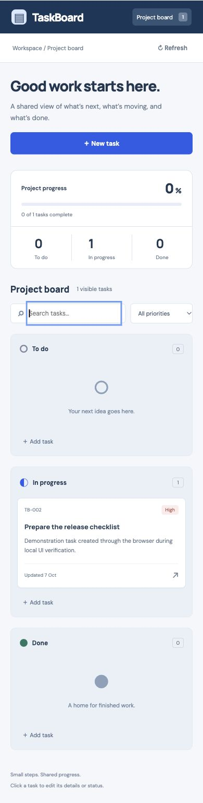

# Application validation — 7 October 2026

These artifacts record work performed by the assistant on the local disposable `devops-oct7-capstone` stack. They do not claim the student personally executed the commands. No existing user database was used.

| Evidence | Observed outcome |
| --- | --- |
| [Application tests/build](tests-2026-10-07.txt) | 11 backend tests and 5 frontend request/error tests passed; production frontend build and both images succeeded |
| [Real PostgreSQL smoke test](postgres-smoke-2026-10-07.txt) | Full CRUD through Nginx: 201/200/204, invalid input 422, deleted task 404, stats, health/readiness and metrics |
| [Persistence and recovery](persistence-recovery-2026-10-07.txt) | Stopped only demo PostgreSQL: health 200, readiness 503; restarted database/backend: readiness 200 and task retained; probe removed |
| [Database query](postgresql-state-2026-10-07.txt) | Alembic revision `0001`; browser-created demonstration task persisted as `in_progress` |
| [Desktop screenshot](taskboard-desktop.jpg) | Actual local browser after create/edit verification |
| [Mobile screenshot](taskboard-mobile.jpg) | Actual browser at 390×844 CSS-pixel viewport; full-page capture; document width 390, no horizontal page overflow |

Browser steps: open the local frontend; create **Prepare the release checklist** with a description explicitly identifying it as demonstration data; select High priority; save; reopen; change status to In progress; save; search for a nonmatching phrase (zero visible tasks); clear search (task returns). Both screenshots show this actual saved task. The browser viewport was restored after mobile verification. The UI deletion route was covered by API integration, not manually clicked in the browser.

One startup problem was found and fixed: a frontend connected only to a Docker `internal` network had healthy container status but no functioning published host port. `docker inspect` showed a configured binding with an empty runtime port mapping. A separate web network was added for the frontend, retaining the internal-only backend/database network and the explicit `127.0.0.1:18080` binding. The smoke test then passed.

The unit test run produced one Starlette deprecation warning concerning its current httpx test-client adapter. All 11 tests passed; this is documented rather than hidden. Database credentials are generated under ignored `.runtime/` and are absent from these artifacts. External security scanner, Kubernetes, cloud and CI execution evidence belongs to the corresponding project sections.

