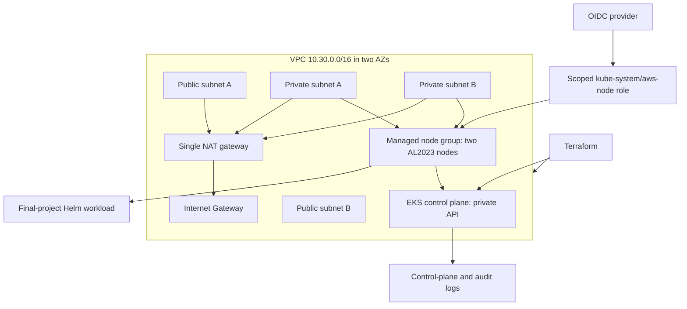

# Final project — prospective AWS EKS infrastructure

Jaivardhan D. Rao · 24BCS10117

This is the final project's Terraform infrastructure implementation. It describes an EKS control
plane, two private worker subnets, two public subnets, a managed node group and the routing and
service roles they need. It can support the project's Helm/Kubernetes workload after a separately
reviewed cloud deployment and access setup.

**Execution status:** Formatting, real provider schema validation and all four mocked tests passed
on 7 October 2026. No AWS resources or IAM identities have been created or changed. Actual output
is recorded in [local-validation.txt](evidence/local-validation.txt). The tests
mock every AWS resource and data source; the mock `apply` exists only to resolve references for
assertions. It is not a real cluster, cloud success screenshot or paid deployment.

`deployment_authorized` defaults to `false`. A VPC precondition stops the normal deployment plan
until an explicitly reviewed deployment decision is supplied. Do not use targeted plans to work
around that guard. Ordinary work on this assignment uses `terraform validate` and `terraform test`.

## Architecture



| File | Responsibility |
| --- | --- |
| `provider.tf` | Terraform version and pinned AWS provider |
| `variables.tf` | Network/version/size inputs and deployment guard |
| `network.tf` | VPC, public/private subnets, internet gateway, NAT and route associations |
| `iam.tf` | EKS/node service roles and a separate CNI service-account role |
| `cluster.tf` | Private EKS cluster, logging, encrypted managed nodes and essential add-ons |
| `outputs.tf` | Prospective cluster name/endpoint and network identifiers |
| `tests/eks.tftest.hcl` | Mocked lifecycle, resource relationships, access controls and invalid-input tests |

## Network, identity and worker choices

- Both AZs have a public and private subnet. Workers are placed only in the private subnets,
  which do not auto-assign public IPv4 addresses. Their package/image/API egress goes through
  one NAT gateway. One NAT lowers the lab's prospective cost but is a single-AZ dependency;
  this is not a production high-availability claim.
- The EKS API has private access enabled and public access disabled. DNS support and hostnames
  are enabled for the VPC. AWS's managed cluster security group handles control-plane/node
  communication; no SSH remote-access block or internet-facing API rule is added.
- API authentication mode is `API`; automatic cluster-creator administrator access is disabled.
  There are **no human or CI administrator access entries** in this configuration. EKS's managed
  node integration is separate from human deployment permission.
- Nodes receive the AWS-managed worker and ECR pull-only policies. VPC CNI permissions are
  assigned to an OIDC role whose trust requires the exact `kube-system/aws-node` service account
  and STS audience. The managed CNI policy still includes the network actions AWS requires;
  it is not attached to the general node role or application service account.
- The launch template encrypts EBS and requires IMDSv2 with a hop limit of one. No SSH key or
  access key is embedded. CoreDNS and kube-proxy are managed add-ons; the VPC CNI is configured
  before nodes and gets its separate role. Add-on versions use AWS's compatible defaults and
  must be reviewed before a future deployment.
- All five control-plane log types are enabled with seven-day CloudWatch retention.

The default Kubernetes version is explicitly `1.35`. AWS lists it under standard support at the
time these notes were prepared; recheck version and add-on availability in the selected Region
before any cloud run. The two selected AZs must support the intended cluster and node capacity.

## Local verification only

From this directory:

```bash
terraform init -backend=false
terraform fmt -check -recursive
terraform validate
terraform test
```

Initialization downloads a public provider package. The tests replace it with Terraform's mock
provider behavior; they do not obtain AWS credentials. Mock fixtures are clearly synthetic.
Checks cover private node placement, subnet AZs, NAT/IGW routing, private API, absence of creator
admin permissions, constrained worker policies, CNI trust and role wiring, IMDSv2, encrypted
disks, audit retention, the deployment guard and invalid inputs. The mock lifecycle tears down
only its synthetic test state.

The default Terraform backend is local. `.terraform/`, state, saved plans and personal tfvars are
ignored. Keep state secure; real state may contain sensitive information. Team deployment would
also need a separately provisioned encrypted, access-controlled remote backend and locking.

## What remains before a real cloud demonstration

No real `plan`, `apply`, cloud IAM operation, kubeconfig change or `destroy` was run for this task.
The following are explicit remaining decisions and evidence, not instructions to execute now:

1. Approve the paid EKS, EC2, EBS, NAT, IPv4 and logging costs, target account/Region and creation
   of the service roles described by the code; review the entire Terraform plan.
2. Review a specific operator/CI IAM identity and narrowly scoped EKS access policy or Kubernetes
   RBAC. Creation permission alone is not permission to deploy this workload. No identity has
   been guessed, auto-promoted or granted access by this task.
3. Provide an approved private network path **and security-group permission** to the API. An
   internet-only GitHub-hosted runner cannot reach this private endpoint directly. The reviewed
   runner or GitOps bootstrap operator needs VPC connectivity.
4. Validate the selected version, add-on compatibility, subnet/IP capacity and quota in AWS.
   The NAT design assumes outbound connectivity for registries and AWS APIs. No VPN, EBS CSI
   driver, Ingress controller or AWS Load Balancer Controller is installed by this Terraform.
   If the workload needs those components, include them in the deployment review; storage/PVCs
   also need the appropriate CSI driver and scoped service identity.
5. After provisioning and access setup, capture actual cluster/node/add-on readiness, deploy the
   Helm release, verify the app and monitoring, then capture successful cleanup. Mock success
   does not replace these requirements.

For a future approved lifecycle, the command sequence is `terraform plan -out=reviewed.tfplan`,
review the plan, `terraform apply reviewed.tfplan`, `terraform output`, and eventually
`terraform plan -destroy` followed by `terraform destroy`. Capture actual output then. Remove
Helm-created LoadBalancers and dynamically provisioned volumes before destroying their cluster,
and verify all paid resources are gone. Keep the state until cleanup is confirmed.

References: [EKS cluster creation](https://docs.aws.amazon.com/eks/latest/userguide/create-cluster.html),
[private endpoint access](https://docs.aws.amazon.com/eks/latest/userguide/cluster-endpoint.html),
[EKS access entries](https://docs.aws.amazon.com/eks/latest/userguide/access-entries.html),
[node IAM policies](https://docs.aws.amazon.com/eks/latest/userguide/create-node-role.html),
[CNI service-account role](https://docs.aws.amazon.com/eks/latest/userguide/cni-iam-role.html),
[EKS version support](https://docs.aws.amazon.com/eks/latest/userguide/kubernetes-versions.html),
[Terraform mocking](https://developer.hashicorp.com/terraform/language/tests/mocking).
