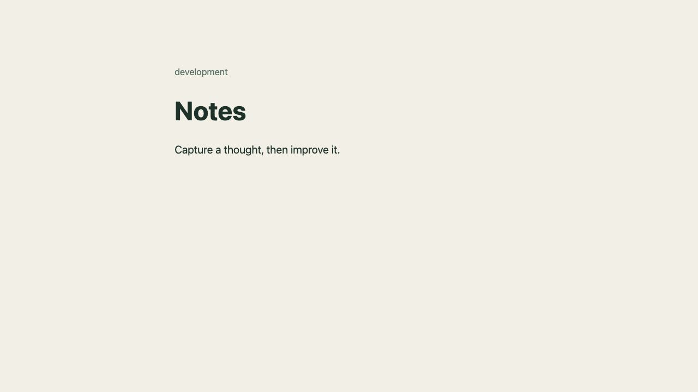

# Session 15 evidence status

[static-validation.txt](static-validation.txt) records Helm v3.19.0 and successful lint checks for both default and production values. Templates also rendered locally without a cluster. The Helm binary's downloaded archive was verified against its published SHA-256 checksum.

[offline-command-practice.md](offline-command-practice.md) adds successful workspace-only `helm create` practice and actual render checks for configurable ports, HTML escaping, content checksum changes, release isolation and production values. The create exercise exposed and fixed the driver's missing scratch-parent creation.

[repository-practice.txt](repository-practice.txt) records successful public chart-index refresh, repository listing and `helm search repo ingress-nginx`. `helm repo add ingress-nginx https://kubernetes.github.io/ingress-nginx` also succeeded with output `"ingress-nginx" has been added to your repositories`. All cache/config/data paths were under the workspace `.runtime/helm`; no chart was installed and no Kubernetes API was contacted.

[helm-run.txt](helm-run.txt) now records the later explicitly authorized live command sequence: install/list/status/get, upgrade to production, bad-image upgrade and failure, history, rollback to revision 2, verification, uninstall and a healthy development reinstall. The command sequence completed. Earlier approval blocks are historical and were not bypassed.

`notes-live.jpg` is the unaltered 12,603-byte JPEG captured by the Codex in-app browser screenshot API at 2026-10-07T18:04:24.621Z. URL: `http://127.0.0.1:18085/`; source: a loopback-only port-forward to `devops-helm/service/notes-notes`. The displayed `development` page is the final healthy reinstall. No screenshot was synthesized from logs or expected output.

The current release history restarts at revision 1 after uninstall/reinstall. The earlier revisions 1–4, including the failed image revision and successful rollback, are preserved in the full raw transcript. Terminal screenshots of those revisions could not be captured because CUA explicitly denied access to `com.apple.Terminal`.
