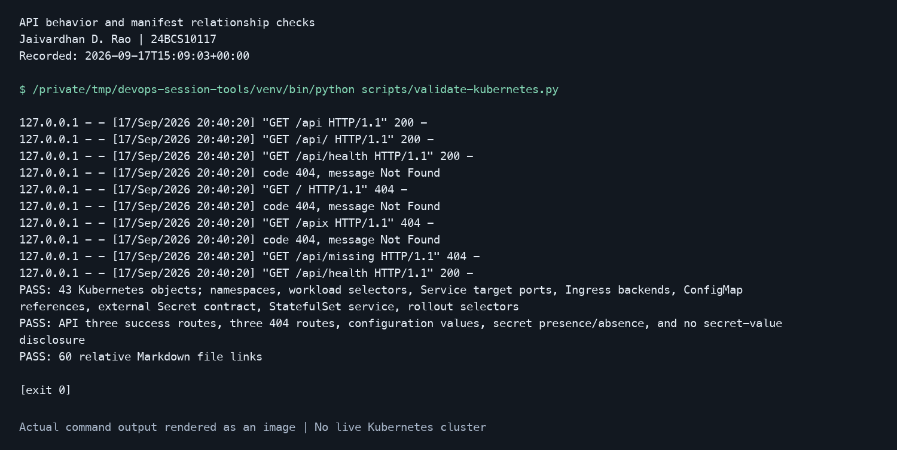

# Session 11: Kubernetes Networking & Services

- **Name:** Jaivardhan D. Rao
- **Enrollment number:** 24BCS10117
- **Status:** October 7 live DNS, ClusterIP/NodePort HTTP, LoadBalancer internal HTTP and broken-selector recovery checks passed. Actual command output is linked below; the homework permits output or screenshots. LoadBalancer external-address/tunnel verification remains pending.

Use the [disposable local lab](../kubernetes-fundamentals/README.md#local-lab-setup), then run the
commands from this folder. A Service gives clients a stable discovery name while its selected
Pods can change. EndpointSlices describe destinations; readiness affects eligible endpoints.

Required research notes: [object comparisons](comparisons.md), [FQDN and Service naming](fqdn/README.md),
and [CoreDNS discovery and troubleshooting](coredns/README.md).

## Service patterns

| Pattern | Manifest | Behavior |
| --- | --- | --- |
| ClusterIP | [clusterip.yaml](clusterip.yaml) | Cluster-internal virtual IP and DNS name. |
| NodePort | [nodeport.yaml](nodeport.yaml) | Service exposed on node port `30081`, subject to node reachability/firewall settings. |
| LoadBalancer | [optional/loadbalancer.yaml](optional/loadbalancer.yaml) | Requires an implementation that supplies a load balancer; a cloud controller can provision external infrastructure. |
| ExternalName | [externalname.yaml](externalname.yaml) | CNAME alias to `kubernetes.io`; no Pod selector or traffic proxy. |
| Headless | [headless.yaml](headless.yaml) | `clusterIP: None`; DNS discovers Pod addresses and a StatefulSet demonstrates stable names. |

Headless is a ClusterIP configuration, not a fifth `spec.type` value. `port` is the Service's
listening port, `targetPort` is the application port (here named `http`), `nodePort` is the
node-facing port, and `containerPort` documents the container's port; it does not start a listener.

## ClusterIP and DNS

```bash
kubectl --context=devops-coursework -n devops-homework apply -f deployment.yaml -f clusterip.yaml -f client.yaml
kubectl --context=devops-coursework -n devops-homework rollout status deployment/service-web --timeout=120s
kubectl --context=devops-coursework -n devops-homework wait --for=condition=Ready pod/dns-client --timeout=120s
kubectl --context=devops-coursework -n devops-homework get services,pods -o wide
kubectl --context=devops-coursework -n devops-homework exec dns-client -- nslookup web-clusterip
kubectl --context=devops-coursework -n devops-homework exec dns-client -- nslookup web-clusterip.devops-homework.svc.cluster.local
kubectl --context=devops-coursework -n devops-homework exec dns-client -- wget -qO- http://web-clusterip
kubectl --context=devops-coursework -n devops-homework get endpointslices -l kubernetes.io/service-name=web-clusterip -o wide
```

Expected behavior: DNS resolves the Service and HTTP returns `Hello from v1`. The full name is
`service.namespace.svc.cluster-domain`; `cluster.local` is the usual domain for this Minikube
setup. In the same namespace, the short Service name is sufficient. From another namespace use
`web-clusterip.devops-homework` or the full name. Inspect the actual resolver search list with:

```bash
kubectl --context=devops-coursework -n devops-homework exec dns-client -- cat /etc/resolv.conf
```

## NodePort and LoadBalancer

```bash
kubectl --context=devops-coursework -n devops-homework apply -f nodeport.yaml
kubectl --context=devops-coursework -n devops-homework get service web-nodeport
minikube -p devops-coursework service web-nodeport -n devops-homework --url
```

Keep the Minikube command running if it opens a tunnel, and curl the exact printed URL from a
second terminal. With Docker on macOS, the node's private IP may not be directly reachable.
Capture both the assigned `30081` NodePort and the returned HTTP response.

The current homework requires the LoadBalancer exercise, despite the retained
`optional/loadbalancer.yaml` filename. Keep it on the local Minikube profile; applying it
to a cloud-backed context can create infrastructure. In one terminal the student can run
`minikube -p devops-coursework tunnel`; in another:

```bash
kubectl --context=devops-coursework -n devops-homework apply -f optional/loadbalancer.yaml
kubectl --context=devops-coursework -n devops-homework get service web-loadbalancer -w
```

Use the address actually assigned by the tunnel to test HTTP. Without a load balancer
implementation an external address may remain pending. Stop the watch with Ctrl+C.

## ExternalName and headless Service

```bash
kubectl --context=devops-coursework -n devops-homework apply -f externalname.yaml -f headless.yaml
kubectl --context=devops-coursework -n devops-homework rollout status statefulset/stateful-web --timeout=120s
kubectl --context=devops-coursework -n devops-homework exec dns-client -- nslookup external-docs
kubectl --context=devops-coursework -n devops-homework exec dns-client -- nslookup web-headless
kubectl --context=devops-coursework -n devops-homework exec dns-client -- nslookup stateful-web-0.web-headless.devops-homework.svc.cluster.local
kubectl --context=devops-coursework -n devops-homework get pods -l app=stateful-web -o wide
```

The ExternalName query should show the alias target; HTTPS using the alias can fail hostname
validation because the upstream certificate is for the original domain. Headless results
identify ready Pod IPs instead of one virtual ClusterIP. This StatefulSet uses Nginx and no
persistent volume; it demonstrates naming, not persistent-data recovery.

## Troubleshooting an empty Service

Temporarily change only this lab Service's selector and inspect the endpoints:

```bash
kubectl --context=devops-coursework -n devops-homework patch service web-clusterip --type=merge -p '{"spec":{"selector":{"app":"deliberately-missing"}}}'
kubectl --context=devops-coursework -n devops-homework get endpointslices -l kubernetes.io/service-name=web-clusterip -o yaml
kubectl --context=devops-coursework -n devops-homework get pods --show-labels
kubectl --context=devops-coursework -n devops-homework apply -f clusterip.yaml
kubectl --context=devops-coursework -n devops-homework exec dns-client -- wget -qO- http://web-clusterip
```

Check labels, readiness, Service ports, EndpointSlices, DNS, then relevant NetworkPolicies.
An empty ready-endpoint list does not by itself prove a DNS failure.

## Evidence and cleanup

### Current live observation

The [fresh resources/HTTP transcript](../evidence/october-7/session-11/current-state.txt)
shows the Service types, ready StatefulSet identities, restored ClusterIP EndpointSlices,
and successful current ClusterIP, node-IP NodePort and internal LoadBalancer responses.
The [fresh DNS transcript](../evidence/october-7/session-11/current-dns.txt) shows absolute
ClusterIP, ExternalName, headless and individual StatefulSet Pod DNS resolution.
These observations do not prove an external LoadBalancer path: its address remains `<pending>`.

For compact native Terminal views, run from the repository root with `LAB_KUBECONFIG`
set to the isolated lab kubeconfig:

```bash
python3 evidence/october-7/live-verify.py 11 --kubeconfig "$LAB_KUBECONFIG" --context devops-oct7
python3 evidence/october-7/live-verify.py 11 --view dns --kubeconfig "$LAB_KUBECONFIG" --context devops-oct7
```

These checks execute actual current API, DNS and HTTP reads. They do not change the
Service selector; the historical broken-selector/recovery transition is in the complete
lab transcript below.

The [completed October 7 transcript](../evidence/october-7/session-11/20261007T101841Z.txt)
records ClusterIP and NodePort HTTP, ExternalName/headless/stable Pod DNS, LoadBalancer
internal Service HTTP, and a selector fault that removed endpoints and broke HTTP before
restoration recovered traffic. The LoadBalancer external address remained pending; internal
HTTP does not establish external or tunnel connectivity. Optional additional screenshots have
not been captured. The [October inventory](../evidence/october-7/README.md) retains the earlier failed
DNS attempt and explains the successful absolute-name queries.

The historical September image below shows static Service-port and reference checks, not live DNS or
network traffic. [Raw logs and live screenshot instructions](../evidence/local-validation/README.md)
are available alongside it.



The October transcript captures DNS answers, HTTP responses, Service ports, StatefulSet names
and selector recovery. Capture the remaining LoadBalancer external-address/tunnel response
and optional additional screenshots. See [validation evidence](../KUBERNETES-VALIDATION.md). After the lab,
delete only these resources with their file paths;
stop any Minikube tunnel. Keep `dns-client` until the session 10 canary check is finished.

References: [instructor session 11](https://github.com/Nency-Ravaliya/devops-heros/tree/1a24fe08c4956db0f8f22ffd6655581f7185699e/session-11-kubernetes-services),
[Services](https://kubernetes.io/docs/concepts/services-networking/service/),
[DNS for Services and Pods](https://kubernetes.io/docs/concepts/services-networking/dns-pod-service/).
