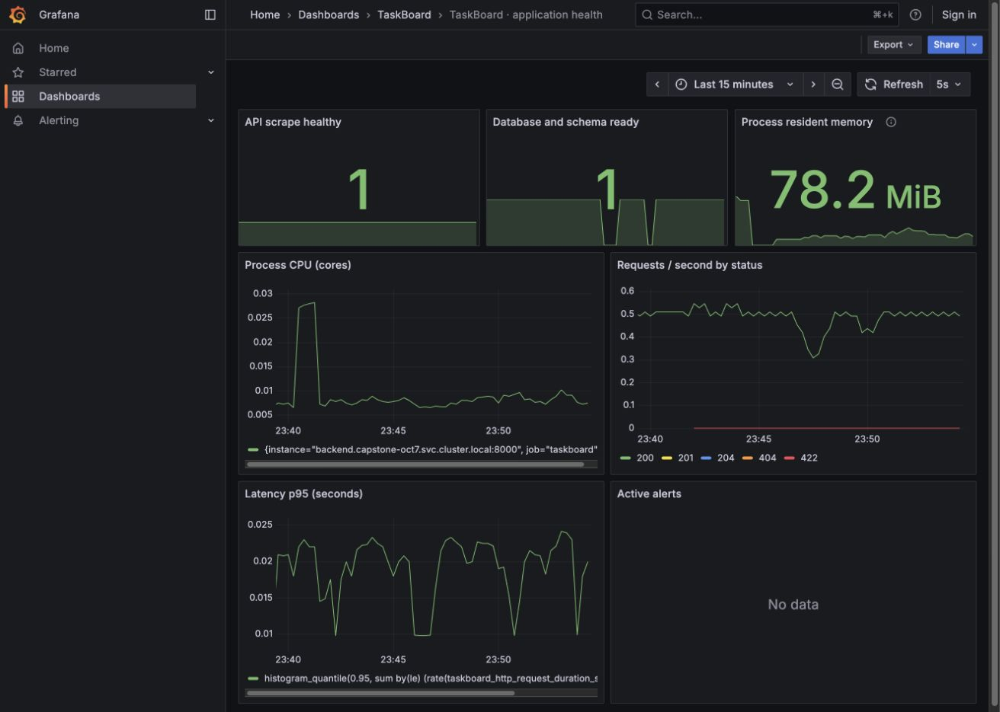

# Session 20 — Monitoring, Observability & GitOps

**Student:** Jaivardhan D. Rao · **Enrollment:** 24BCS10117

This submission connects monitoring to the [TaskBoard final project](../final-devops-project/). The executable monitoring stack, dashboard and alert rules are in [monitoring](../final-devops-project/monitoring/); the GitOps definitions and reconciliation instructions are in [gitops](../final-devops-project/gitops/).

**Verified on October 7:** the deployed TaskBoard produces real CPU, memory, HTTP and latency metrics, with scrape health and database readiness both `1`. A controlled routing fault produced HTTP 502 and a firing readiness alert; correction restored HTTP 200 and cleared alerts. [Runtime evidence and the genuine browser dashboard](../final-devops-project/monitoring/evidence/2026-10-07-completed/README.md) record the results. Argo CD reached Synced/Healthy from `main` and automatically repaired deliberate ConfigMap drift, with [the exact Git revision and timeline](../final-devops-project/gitops/README.md).

This is a genuine browser capture from the local cluster. The [earlier image](../final-devops-project/monitoring/evidence/2026-10-07-completed/grafana-before-threshold-fix.jpg) preserves a display bug: Grafana’s inherited raw-byte threshold colored normal RSS red. Explicit byte thresholds corrected that presentation; actual alert/recovery output is linked below.

## Monitoring demonstration

Prometheus records API request count, error responses, request-duration buckets, process CPU seconds, resident memory and scrape health. A separate HTTP blackbox probe checks `/ready`, including PostgreSQL connectivity and the migrated tasks table. Grafana provisions a dashboard for availability, readiness, CPU, memory, traffic, latency and firing alerts. The stack runs on ClusterIP services with laptop access through loopback port-forwards.

CPU rate (`rate(process_cpu_seconds_total[1m])`) measures cores used by the API process; memory (`process_resident_memory_bytes`) measures its resident bytes. These are process measurements, not full-node resource usage. Use `kubectl top pods` to compare container CPU/memory from metrics-server and inspect HPA. The dashboard RSS warning thresholds are explicit bytes: yellow at the 128 MiB Pod request, red at 90% of the 256 MiB limit. RSS is not total container memory, so this is an early warning rather than an OOM prediction.

Logs are available through `kubectl logs deployment/backend`. A failing request is investigated by matching its timestamp/status with request logs, readiness, Service endpoints and database Pod status. There is no notification receiver, so a firing alert does not email or message anyone.

The [controlled selector-fault runbook](../final-devops-project/troubleshooting/README.md) breaks backend routing, captures the resulting alert and restores the selector. [Saved fault and recovery evidence](../final-devops-project/troubleshooting/evidence/2026-10-07/README.md) includes the actual HTTP response, EndpointSlices and alert state. Metrics scraping can remain up through an existing TCP connection while new requests fail, so the independent readiness probe is essential.

## Observability concepts

**Metrics** summarize numeric behaviour over time. Prometheus and Grafana make rates, percentiles, saturation and error trends visible. Metrics answer whether a service is unhealthy but can hide individual outliers.

**Logs** record discrete events, request results and error context. Kubernetes exposes container stdout/stderr through `kubectl logs`; Loki, Elasticsearch and OpenSearch can centralize searchable logs. Avoid logging credentials or full database URLs.

**Traces** connect spans of one request across frontend, API, database and other services. OpenTelemetry instrumentation plus a backend such as Tempo or Jaeger can show where latency accumulates. This project documents that extension; it does not claim an installed tracing collector or trace backend.

Observability is needed because an apparently healthy Pod can still serve errors when routing, schema or a downstream dependency is broken. Kubernetes probes, events, resource metrics and application telemetry provide different evidence. `/health` proves the process responds, while `/ready` also verifies the database/schema.

## GitOps

Git holds reviewed declarative desired state. A controller reads a selected repository revision, compares it with cluster resources and reconciles drift. Changes flow through review and an immutable commit; credentials remain outside Git. Argo CD supports sync status and reconciliation for Kubernetes and Helm.

The [GitOps runbook](../final-devops-project/gitops/README.md) explains the source revision, chart values, controlled drift and verification. HPA owns backend replica count, so it is omitted from the rendered Deployment when autoscaling is enabled. The existing password Secret and database data are not generated from public Git content.

## References

- [Current instructor homework](https://docs.google.com/document/d/1cjXFYf2Thm8cBEN-0C48B-v02cj3jGLd47lcO18prHE/edit)
- [Prometheus configuration](https://prometheus.io/docs/prometheus/latest/configuration/configuration/)
- [Argo CD declarative setup](https://argo-cd.readthedocs.io/en/stable/operator-manual/declarative-setup/)
- [Kubernetes resource management](https://kubernetes.io/docs/concepts/configuration/manage-resources-containers/)
