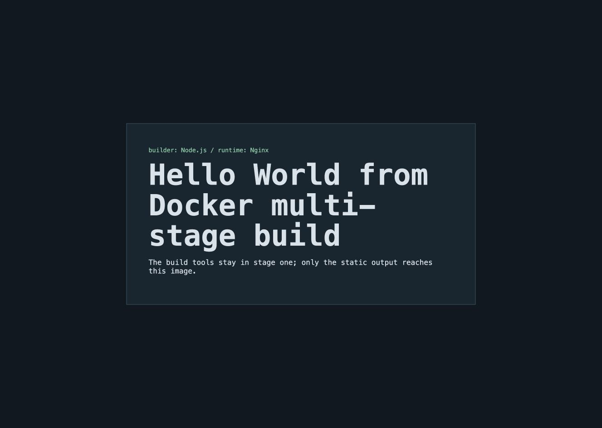

# Multi-stage Docker build

- **Name:** Jaivardhan D. Rao
- **Enrollment number:** 24BCS10117

The first stage uses Node.js and Vite to create the static production files. The runtime stage
copies only `dist/` into Nginx, so Node.js, npm, and the source tree are not included in the final
image.

## Commands used

```bash
docker build -t devops-multi-stage ./multi-stage-build
docker run --rm -d --name devops-multi-stage -p 8080:80 devops-multi-stage
curl http://localhost:8080
docker ps --filter name=devops-multi-stage \
  --format 'table {{.Names}}\t{{.Status}}\t{{.Ports}}'
docker stop devops-multi-stage
```

The page displays `Hello World from Docker multi-stage build` at
`http://localhost:8080`. Output from the verified run is saved in [verification.txt](verification.txt).

## Fresh build and browser screenshot — 7 October 2026

[Raw build, HTTP, and `docker ps` output](evidence/live-20261007T180045Z.txt) verifies the required heading and `127.0.0.1:8080->80/tcp` mapping. A runtime check confirmed the final Nginx container had neither the Node executable nor `/app/node_modules`. The following unaltered screenshot shows the real browser page at `http://127.0.0.1:8080/`; the temporary container was removed after capture.



Reproduce from the repository root: `python3 scripts/run-foundation-evidence.py --topic multistage --pause`. The runner refuses to start if port 8080 is already in use.
