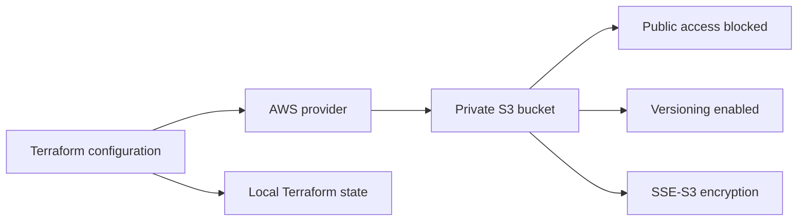

# Session 18 — Terraform S3 demo

Jaivardhan D. Rao · 24BCS10117

This project describes a private, versioned S3 bucket using Terraform. The separate research notes
cover [IAM](../aws-services/01-iam/README.md), [EC2](../aws-services/02-ec2/README.md),
[S3](../aws-services/03-s3/README.md), [VPC](../aws-services/04-vpc/README.md) and
[DynamoDB/RDS](../aws-services/05-dynamodb-rds/README.md).

**Status:** Provider initialization, schema validation and both mocked tests passed on 7 October 2026.
No real AWS bucket has been created
by this work. AWS plan, apply, show/output, destroy and console screenshots are still pending.
The [raw validation log](evidence/local-validation.txt) records only the checks actually run;
the tests use a mocked AWS provider, so their success cannot prove AWS permissions or deployment.

## Files and concepts

| File | Purpose |
| --- | --- |
| `provider.tf` | Terraform version range, pinned AWS provider and Region/tags |
| `variables.tf` | Typed input variables with naming validation |
| `terraform.tfvars` | Public coursework defaults; contains no authentication material |
| `main.tf` | Bucket, ownership, public-access controls, versioning and encryption |
| `outputs.tf` | Bucket name, ARN and Region after a real deployment |
| `.terraform.lock.hcl` | Exact provider selection and package checksums |
| `tests/bucket.tftest.hcl` | Credential-free plan assertions and invalid-input test |

The bucket uses a prefix so the provider can append a unique suffix. Every companion resource
references `aws_s3_bucket.coursework.id`; these references give Terraform the dependency order.
Public ACLs and bucket policies are blocked, ACLs are disabled through bucket-owner enforcement,
versioning is enabled, and SSE-S3 encryption is explicit. `force_destroy = false` means Terraform
will refuse to delete a nonempty bucket instead of silently removing its contents.



## Local checks that do not create AWS resources

From this folder, with Terraform 1.7 or newer:

```bash
terraform init -backend=false
terraform fmt -check -recursive
terraform validate
terraform test
```

`init` downloads the pinned public provider package; it is not a resource deployment. These
tests explicitly declare `mock_provider "aws"` and run plan assertions, checking private access,
versioning, encryption, ownership and invalid bucket prefixes. Mock data is test data.

## Complete real AWS workflow — pending execution

Use a disposable coursework AWS account and its existing short-lived SSO/role session. Review
the target account/Region before proceeding. Credentials belong in the AWS credential chain,
never in `.tf`, `.tfvars`, screenshots or Git. These commands are a runbook, **not recorded output**.

```bash
# Inspect the authenticated target account, without printing credentials.
aws sts get-caller-identity
terraform init
terraform fmt -check -recursive
terraform validate
terraform plan -out=coursework.tfplan
# Read the plan before approving the exact saved changes.
terraform apply coursework.tfplan
terraform show
terraform state list
terraform output
terraform output -raw bucket_name
```

`plan` compares configuration, state and actual AWS objects. `apply` creates the reviewed
changes. `show` displays state, while `output` presents only declared output values. The local
`terraform.tfstate` maps resource addresses to AWS objects and can contain sensitive data;
it and saved plans are ignored by Git. Losing state does not delete the AWS resources. For
team use, migrate to an access-controlled remote backend with state locking and encryption.

Verify the bucket in the S3 console: public access blocked, versioning enabled and default
encryption set. Capture the successful plan/apply and console checks, then clean up the same
disposable stack:

```bash
terraform plan -destroy -out=cleanup.tfplan
terraform apply cleanup.tfplan
terraform state list
```

The assignment also calls for practicing `terraform destroy`, which is the interactive shortcut
for planning and applying destruction. Use it **instead of** the saved cleanup plan when practicing
that command, and review its proposed changes before confirming:

```bash
terraform destroy
```

Keep the bucket empty for this lab. If objects were added, all versions and delete markers must
be reviewed and removed explicitly before the nonempty-bucket protection allows cleanup. Do not
delete state to work around a failed destroy. Verify the bucket no longer exists in the console.

## Submission evidence still needed

1. Successful real AWS plan and apply output.
2. `terraform show`, `terraform state list` and `terraform output` output.
3. Console screenshot showing the bucket and its security/versioning settings.
4. Successful destroy output and confirmation that the lab bucket is gone.

No sample success output is presented as a completed AWS run.

References: [Terraform workflow](https://developer.hashicorp.com/terraform/cli/run),
[provider mocking](https://developer.hashicorp.com/terraform/language/tests/mocking),
[S3 public-access resource](https://registry.terraform.io/providers/hashicorp/aws/6.58.0/docs/resources/s3_bucket_public_access_block),
[Terraform state](https://developer.hashicorp.com/terraform/language/state).
